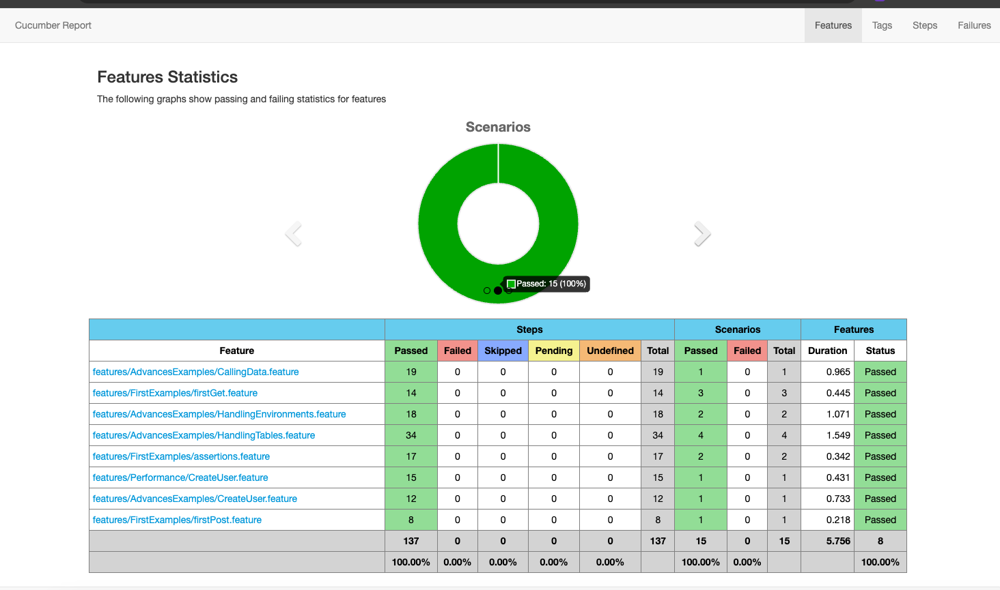

# Overview Karate DSL

This repository contains a series of examples in order to familiarize yourself with karate dsl. 

# Prerequisites
[](https://code.visualstudio.com/download)
[](https://www.azul.com/downloads/#zulu)
[](https://www.java.com/es/)

# Clone de project
Go to the project directory

```bash
 git clone https://github.com/CamiloPosada19/KarateTemplate.git
```

# Install dependencies
Go to the project directory

```bash
  mvn clean install
```

# Launch test

```bash
  cd myproject
  mvn clean test
```

# Launch test by tags

```bash
  mvn test "-Dkarate.options=--tags @debug
```

# Launch test by tags with environments

```bash
   mvn test "-Dkarate.options=--tags @camilo" -DKarate.env="dev"
```

## FirstExamples

In this folder you will find simple examples covering the basic functionalities of the library. Here is a summary of what you can find:

1. **Get:** Basic examples of how to perform GET requests through the library.
2. **Post:** Basic examples of how to send POST requests using the library.
3. **Types of validations:** Examples showing different types of assertions that can be used to verify test results.

## AdvanceExamples

In this folder you will find more advanced examples that delve into more complex features of the library. Here is what you can expect:

4. **Read Data from Other Files:** Advanced examples demonstrating how to read data from external files.
5. **Environment Variables Management:** Examples illustrating how to use environment variables in testing.
6. **Table management:** Advanced examples of how to handle data in the form of tables.


